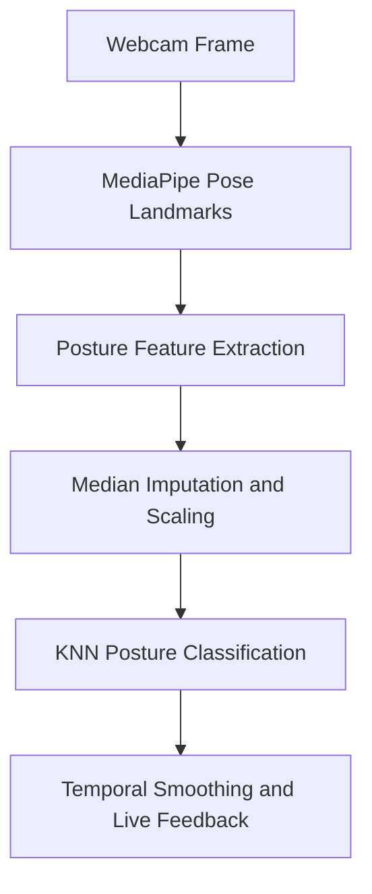

# AI Posture Fixer — General Model

AI Posture Fixer is a real-time computer vision system that detects a user's sitting posture and classifies it as either **Good Posture** or **Bad Posture**.

The system uses MediaPipe Pose to extract body landmarks, a K-Nearest Neighbors (KNN) classifier to evaluate posture, and temporal smoothing to provide stable visual feedback through a webcam feed.

The project was developed as an end-to-end machine learning pipeline, including data preprocessing, model selection, participant-independent evaluation, model export, and live inference.

## System Overview



## Main Features

* Real-time webcam-based posture monitoring
* Good Posture and Bad Posture classification
* MediaPipe-based face, ear, eye, and shoulder landmark extraction
* Geometric posture feature extraction
* Median imputation for missing landmarks
* Standard feature scaling
* KNN hyperparameter selection using a predefined validation split
* Participant-independent train, validation, and test datasets
* Stable posture estimation using a sliding prediction window
* Color-coded feedback:

  * Green for Good Posture
  * Red for Bad Posture

## Model Evaluation

The general model was evaluated using people who were kept separate across the training, validation, and test datasets.

This participant-independent evaluation provides a more realistic estimate of how the system performs when used by a new person.

| Dataset          | Number of Samples | Accuracy |
| ---------------- | ----------------: | -------: |
| Validation       |             1,774 |      74% |
| Independent Test |             2,471 |      79% |

### Test Set Classification Results

| Class        | Precision | Recall | F1-score |
| ------------ | --------: | -----: | -------: |
| Bad Posture  |      0.98 |   0.65 |     0.78 |
| Good Posture |      0.67 |   0.98 |     0.80 |

The high recall for Good Posture means that correctly seated users are rarely warned unnecessarily.

Improving the recall for Bad Posture is an important direction for future development.

## Repository Structure

| Step | File                                    | Description                                                                                                                                                                                |
| ---: | --------------------------------------- | ------------------------------------------------------------------------------------------------------------------------------------------------------------------------------------------ |
|    1 | `cross_validation.py`                   | Loads the training and validation datasets, preprocesses the data, evaluates different KNN configurations, selects the best hyperparameters, and generates validation results and figures. |
|    2 | `train_general_model_with_train+val.py` | Combines the training and validation datasets, trains the final general KNN model, evaluates it on the independent test set, and exports the trained components.                           |
|    3 | `knn_blackbox.joblib`                   | Contains the packaged preprocessing components and trained KNN model required for posture inference.                                                                                       |
|    4 | `run_live_posture_monitor.py`           | Loads the packaged model, extracts posture features from a live webcam stream, classifies the user's posture, smooths the predictions, and displays real-time visual feedback.             |


## Technology Stack

* Python
* OpenCV
* MediaPipe Pose
* scikit-learn
* pandas
* NumPy
* Matplotlib
* Seaborn
* Joblib

## Installation

Clone the repository:

```bash
git clone https://github.com/esterfradkin1/AI-Posture-Fixer-General-Model.git
cd AI-Posture-Fixer-General-Model
```

Create a virtual environment:

```bash
python -m venv .venv
```

Activate the virtual environment on Windows:

```powershell
.venv\Scripts\activate
```

Activate it on macOS or Linux:

```bash
source .venv/bin/activate
```

Install the required packages:

```bash
pip install opencv-python mediapipe joblib numpy pandas scikit-learn matplotlib seaborn openpyxl
```

The `openpyxl` package is required only when the training datasets are stored as Excel files.

## Dataset Structure

The training pipeline expects three participant-independent dataset folders:

```text
data/
├── train_datasets/
├── validation_datasets/
└── test_datasets/
```

Each folder may contain `.csv` or `.xlsx` files.
https://drive.google.com/file/d/1J-6ews8nyrxopF3gwI5lxF0rD_ZnvIEv/view?usp=sharing
Every dataset must contain:

* `Label` — the target class, such as `Good_Posture` or `Bad_Posture`
* `Image_ID` — an optional sample identifier that is excluded from training
* The same numeric posture feature columns in every dataset split

## Extracted Posture Features

The model uses normalized landmark coordinates and geometric posture measurements.

Examples include:

* `headForwardDepth`
* `headHeight`
* `shoulderTilt`
* `torsoRotation`
* `shoulderWidth`
* `thetaNeck`
* `thetaNeck_rel`
* `theta_shoulders`
* Ear-to-shoulder angles
* Eye, ear, nose, and shoulder coordinates
* Landmark visibility values

## Configuration

The training scripts currently contain local Windows paths.

Before running the training pipeline, update the following variables so they point to the correct dataset folders on your computer:

```python
train_folder = r"path\to\train_datasets"
val_folder = r"path\to\validation_datasets"
test_folder = r"path\to\test_datasets"
```

Before running live inference, update `PACK_PATH` in `run_live_posture_monitor.py`.

If the model file is located in the repository root, use:

```python
PACK_PATH = "knn_blackbox.joblib"
```

## Usage

### 1. Hyperparameter Selection

Run:

```bash
python cross_validation.py
```

This script:

1. Loads the separate training and validation datasets.
2. Fits the imputer and scaler using training data only.
3. Evaluates different KNN configurations on the predefined validation set.
4. Prints the complete feature-importance ranking.
5. Generates a validation classification report.
6. Creates a validation confusion matrix.
7. Saves the selected model and preprocessing components.

The evaluated KNN parameters include:

* Number of neighbors
* Euclidean or Manhattan distance
* Uniform or distance-based weights

### 2. Final Model Training and Evaluation

Run:

```bash
python "train_general_model_with_train+val.py"
```

This script:

1. Combines the training and validation datasets.
2. Fits the preprocessing components on the combined data.
3. Trains the final KNN model.
4. Evaluates the model on the independent test set.
5. Prints the test accuracy and classification report.
6. Generates the test confusion matrix.
7. Saves the trained model components.

### 3. Live Posture Monitoring

Connect a webcam and run:

```bash
python run_live_posture_monitor.py
```

The live display shows:

* The current frame-level prediction
* The smoothed stable posture state
* The proportion of recent frames classified as Bad Posture
* The time elapsed since the last stable-state change
* The estimated Bad Posture probability, when available

Press **Q** to close the webcam window.

## Live Decision Logic

Individual frame predictions may fluctuate because of movement, partial occlusion, or pose-landmark noise.

The live monitor therefore applies asymmetric temporal smoothing:

* A sliding prediction window is used before changing the stable state from Good to Bad.
* A shorter sequence of Good predictions allows faster recovery from Bad to Good.
* Frames with too many missing features are classified as `Unknown`.

The smoothing parameters can be adjusted in `run_live_posture_monitor.py`:

```python
FPS = 30
WINDOW_SEC = 2.0
BAD_ON_RATIO = 0.5
GOOD_RECOVERY_FRAMES = 20
```

## Generated Outputs

The training scripts create a `models` directory containing files such as:

* `feature_importance.svg`
* `grid_search_accuracy_vs_k.svg`
* `validation_confusion_matrix.svg`
* `test_confusion_matrix_new.svg`
* `best_posture_knn_model.pkl`
* `posture_imputer.pkl`
* `posture_scaler.pkl`
* `posture_label_encoder.pkl`

## Reproducibility Notes

* Participants should remain separate across the training, validation, and test datasets.
* This separation prevents identity leakage and provides a more realistic evaluation.
* Preprocessing components should be fitted only on the appropriate training split.
* The same feature columns and feature order must be used during training and live inference.
* The final test dataset should be evaluated only after model selection is complete.

## Limitations

* Performance depends on camera placement and viewing angle.
* Poor lighting may reduce pose-landmark quality.
* The user's head and shoulders must be visible.
* The model currently provides only a binary Good or Bad classification.
* The general model may perform differently for users or sitting environments that are not represented in the dataset.
* The current system does not identify the specific cause of incorrect posture.

## Future Work

Possible future improvements include:

* Collection of a larger and more diverse dataset
* Identification of specific posture problems
* Improve and develop further graphical user interface
* Audio or desktop notifications
* Posture history and analytics
